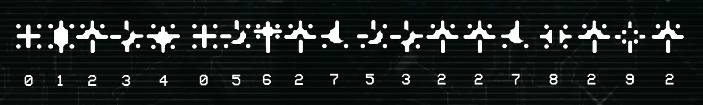

# HuragokForce2: Substitution Cipher Solver



A dictionary-driven substitution cipher solver for deciphering Halo 3: ODST subglyphs.

Successor to [HuragokForce](https://github.com/user/HuragokForce), which used brute-force permutation + NTextCat language detection. This version is fundamentally different in approach and solves the two major problems of the original.

## TL;DR

Tried to decipher the glyphs by another method. Was fun again. Still did not provide an indisputable, definitive answer.

#1 Result is:
```
"the noticed i need were"
```

Why this could be interesting (likely isn't, though, manage your expectations): 
* That string of glyphs can be fully seen when the Engineer is "merging" with Vergil, trying to communicate again but in a "corruped" way. 
* Part of the story of ODST is an ONI agent (Dare) trying to get to Vergil because of an anomaly that was detected.
* Another type of glyphs (Halopedia calls it the [small line type](https://www.halopedia.org/Forerunner_symbols#Small_line_type)) was effectively "deciphered" but it was noticed that there was a typo in its usage.

=> So with a bit of copium, this could be interpreted as _"They noticed I am here."_ or something like that.

## The Problem

A sequence of 19 subglyphs from one frame in the "audio logs" of Halo 3: ODST potentially encodes an English message. Each glyph maps to a unique letter (bijective substitution cipher). The raw sequence:

```
Position:  0  1  2  3  4  5  6  7  8  9 10 11 12 13 14 15 16 17 18
Glyph:     0  1  2  3  4  0  5  6  2  7  5  3  2  2  7  8  2  9  2
```

Glyph `2` appears 6 times out of 19 (~31%), making it the most frequent. Based on English letter frequency analysis, it is assumed to be **E**. This leaves 9 unknown glyphs mapping to 9 distinct letters out of 25 remaining.

## What Went Wrong with v1

1. **Forced assumptions**: To reduce the search space from ~19 billion permutations, v1 arbitrarily assumed glyph `8` = Y (in addition to glyph `2` = E). The E assumption was well-founded on frequency analysis, but the Y assumption was a guess that likely eliminated the correct answer.

2. **No word segmentation**: v1 joined the 19 characters into a spaceless string and fed it to NTextCat for language detection. Without spaces, the language detector struggled badly: confidence scores were noisy and nearly all candidates scored similarly.

3. **Estimated runtime**: ~15 days of continuous computation.

## How v2 Solves This

### Dictionary-driven search (not brute-force)

Instead of generating all letter permutations and checking "is this English?", v2 does the reverse: it tries to **place dictionary words** at each position in the sequence and checks whether the implied glyph-to-letter mapping is **consistent** (bijective). This is vastly faster because the dictionary constrains the search immediately.

### Built-in word segmentation

Spaces are found automatically. Each result is a segmentation of the 19-character string into real English words. No external language detection library needed.

### Honest search (no forced Y)

All 9 unknown glyphs are explored with the full 25-letter candidate pool (A-Z minus E). No arbitrary letter assumptions beyond the well-founded E.

### Quality filtering and scoring

Results are filtered by:
- Maximum number of words (default: 5)
- Minimum average word length (default: 3.8)
- At most 1 short word (length <= 2, and only `a` or `i`)
- At least one word of length >= 5
- At least 2 words of length >= 4

Scoring combines word frequency (common English words score higher) with a length bonus (longer words are more meaningful in a cipher context).

## Comparison

| Aspect | v1 (HuragokForce) | v2 (HuragokForce2) |
|---|---|---|
| Unknowns | 8 (forced Y) | 9 (honest) |
| Alphabet | 20 letters (removed Q,J,Z,X) | 25 letters (full minus E) |
| Space detection | None (NTextCat on spaceless string) | Dictionary word segmentation |
| Scoring | NTextCat confidence threshold | Word frequency + length scoring |
| Search strategy | Exhaustive permutation | Dictionary-driven backtracking |
| Runtime | ~15 days estimated | ~75 seconds |
| Dependencies | .NET, NTextCat | Python 3, system dictionary |

## Usage

```bash
python3 solver.py
```

Requires:
- Python 3.8+
- `/usr/share/dict/words` (standard on most Linux distributions)

Results are printed to stdout and saved to `results.txt`.

## Configuration

Tunable constants at the top of `solver.py`:

- `GLYPH_SEQUENCE`: the raw glyph sequence
- `KNOWN_MAPPING`: pre-solved glyph-to-letter mappings (default: `E = e`)
- `MAX_WORDS`, `MIN_AVG_WORD_LEN`, `MAX_SHORT_WORDS`, etc.: quality filters
- `TOP_N`: how many top results to display

## Top Results (with E assumption)

The highest-scoring result:

```
#1  score= 27.3  "the noticed i need were"
    raw=THENOTICEDINEEDWERE  [0=T, 1=H, 3=N, 4=O, 5=I, 6=C, 7=D, 8=W, 9=R]
```

**Copium mode:** This _might_ be a valid solution. To explain: the "string of glyphs" that is being analyzed here can only be fully seen in a frame from the "CIRCLE 9 ARC 2" audio log. In the story, that is precisely when Sadie is figuring out that the Engineers are "helping" Vergil (in her words, because as we learn later, the freed Engineer is 'merging' with Vergil). At this moment, in the audio logs, Vergil sounds worryingly corrupted. So I might be happy with the idea of this result being a "slightly corrupted" message, and one saying something like _"They noticed I am here"_ (either the ONI, hence Dare's mission, or the Covenant maybe) or something like that.

Full results in `results.txt`.

## Validating the E Assumption (solver_no_e.py)

To test whether the `2=E` assumption was biasing results, a second variant (`solver_no_e.py`) was run with **zero assumptions**: all 10 glyphs treated as unknown, full 26-letter alphabet available.

```bash
python3 -u solver_no_e.py | tee solver_no_e_output.log
```

### Results

- **144,897 unique segmentations** found (vs 100,176 with E assumed)
- The #1 result is identical: `"the noticed i need were"` with `2=E`
- **98 out of the top 100 results independently chose `2=E`**

The 2 non-E results in the top 100:
- `"i not bishops too promo"` (2=O, #8): grammatically broken, semantically random (although quite hilarious)
- `"crays cleanly a and aha"` (2=A, #73): nonsensical

Further down, non-E results are all word salad: `"a for mascots root hobo"`, `"okay not warty a armada"`, `"head who pagoda a guava"`, etc. None come close to forming a coherent phrase.

**Conclusion:** The E assumption is validated. The solver independently converges on `2=E` as the only letter that produces meaningful English. Full no-E results in `results_no_e.txt`.

## Re-ranking by Phrase Coherence (rerank.py)

The solver's score is purely per-word (word frequency + length bonus). It has no notion of whether the words make sense _together_. To address this, `rerank.py` scores each phrase using a **KenLM 3-gram language model** trained on the NLTK Brown corpus (~57k sentences of general English). This gives real statistical n-gram probabilities rather than hand-tuned heuristics.

The combined score = `word_score + 1.0 * (lm_score / num_words)`.

### Setup

The reranker requires a Python venv with `kenlm` and `nltk`, plus a pre-built language model (`brown_3gram.bin`). To rebuild from scratch:

```bash
# 1. System dependencies (for building the KenLM lmplz binary)
sudo apt install cmake libboost-all-dev

# 2. Python venv
python3 -m venv venv
source venv/bin/activate

# 3. Build & install KenLM Python bindings from source
#    (the PyPI version doesn't support Python 3.14)
git clone --depth 1 https://github.com/kpu/kenlm.git /tmp/kenlm_build
cython --cplus /tmp/kenlm_build/python/kenlm.pyx
pip install /tmp/kenlm_build

# 4. Build the lmplz binary (needed to create the language model)
#    Note: boost_system was removed in Boost 1.89+, so remove it from CMakeLists.txt
sed -i '/^  system$/d' /tmp/kenlm_build/CMakeLists.txt
mkdir /tmp/kenlm_build/build && cd /tmp/kenlm_build/build && cmake .. && make -j$(nproc)

# 5. Generate the language model from NLTK Brown corpus
pip install nltk
python3 -c "import nltk; nltk.download('brown')"
python3 -c "
from nltk.corpus import brown
with open('/tmp/brown_corpus.txt', 'w') as f:
    for sent in brown.sents():
        f.write(' '.join(w.lower() for w in sent) + '\n')
"
/tmp/kenlm_build/build/bin/lmplz -o 3 --text /tmp/brown_corpus.txt --arpa /tmp/brown_3gram.arpa
/tmp/kenlm_build/build/bin/build_binary /tmp/brown_3gram.arpa brown_3gram.bin
```

### Usage

```bash
source venv/bin/activate
python3 rerank.py results.txt
python3 rerank.py results_no_e.txt
```

### Example

Per-word breakdown for the #1 result:
```
"the noticed i need were"
  the=-0.9/2g  noticed=-5.1/1g  i=-3.2/1g  need=-3.1/2g  were=-3.0/1g
```
Each entry shows `word=log10_prob/ngram_order`. The `/2g` means KenLM found a matching bigram context; `/1g` means it fell back to unigram. `[OOV]` flags words not in the training vocabulary. Re-ranked results in `reranked_results.txt`.

## Semantic Analysis (by AI agent)

As a final pass, the full results were reviewed by an AI agent (Claude) for semantic coherence and contextual relevance to the Halo 3: ODST storyline. This goes beyond what automated scoring can do, evaluating whether a phrase _means something_ in context.

### Tier 1: Most coherent candidates

**"the noticed i need were"** (#1, score 27.3): The strongest candidate overall. Grammatically imperfect, but interpretable as a corrupted message: _"They noticed I need were [here]"_ or _"The [ones who] noticed I need were..."_. Fits the ODST context where Vergil/the Engineer is merging and struggling to communicate.

**"open voiced i need here"** (#93, score 24.7): Could be parsed as _"[I] openly voiced: I need [to be] here"_. An Engineer declaring its presence or purpose.

**"when swiped i need mete"** (#235, score 24.2): _"When swiped, I need..."_ : a fragmented message about being taken.

### Tier 2: Interesting but weaker

- **"one spoiled i seed were/here"** (#59/#69): corrupted message about something being ruined (the Ark's Portal?)
- **"lies planet a see there"** (#58): evocative but grammatically broken (_"lies on the planet, a sight to see there"_?)
- **"a web fastens been here"** (#134): oddly resonant for an Engineer connecting to systems

### Tier 3: Structural noise

Most results in the "open [past-tense-verb] a need were/here" pattern (#21-50) are structural artifacts; the glyph pattern at positions 3-8 happens to match many past tense verbs, producing dozens of variations that share the same underlying structure.

## Reversed Reading Direction (solver_reversed.py)

In Sadie's Story, especially when Vergil is supposedly "broken" or "corrupted", some frames appear warped or mirrored. So the glyph sequence might actually need to be read in reverse. To cover this possibility, a reversed variant was run reading the sequence backwards:

```
Original: 0  1  2  3  4  0  5  6  2  7  5  3  2  2  7  8  2  9  2
Reversed: 2  9  2  8  7  2  2  3  5  7  2  6  5  0  4  3  2  1  0
```

```bash
python3 solver_reversed.py
```

**120,219 unique segmentations** found (vs 100,176 forward). The reversed sequence is structurally different: it starts and ends with glyph 2 (E), and has a double-E at positions 5-6, which heavily constrains what words can appear.

Top results are phrases like `"eye cheep the a torpedo"`, `"even heel the stapler a"`, `"eye wheel the stabled a"`, etc. None form coherent English sentences. The reversed direction does not produce any more meaningful results than the forward reading, reinforcing that the original left-to-right reading is the more likely intended direction (if there is one at all).
